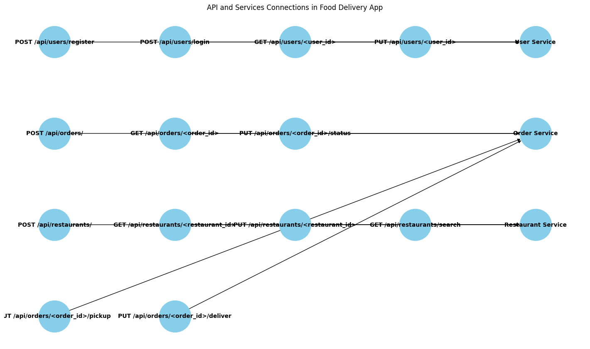

# Food Delivery App

This is a microservice-based food delivery app built with Flask.

## Setup

1. Clone the repository.
2. Create a virtual environment and activate it.
3. Install the dependencies:
    ```sh
    pip install -r requirements.txt
    ```
4. Create a `.env` file and add your environment variables.
5. Run the application:
    ```sh
    python app.py
    ```

## Endpoints

### User Endpoints
- **POST /api/users/register**: Register a new user.
  - **Request Body:**
    ```json
    {
      "username": "testuser",
      "email": "testuser@example.com",
      "password": "password",
      "role": "user"
    }
    ```
  - **Response:**
    ```json
    {
      "message": "User registered successfully"
    }
    ```

- **GET /api/users/<user_id>**: Get user profile.
  - **Response:**
    ```json
    {
      "username": "testuser",
      "email": "testuser@example.com",
      "phone": "1234567890",
      "delivery_address": "123 Test St",
      "payment_info": "Payment Info"
    }
    ```

- **PUT /api/users/<user_id>**: Update user details.
  - **Request Body:**
    ```json
    {
      "email": "newemail@example.com",
      "phone": "1234567890",
      "delivery_address": "123 New St",
      "payment_info": "New Payment Info"
    }
    ```
  - **Response:**
    ```json
    {
      "message": "User details updated successfully"
    }
    ```

### Order Endpoints
- **POST /api/orders/**: Create a new order.
  - **Request Body:**
    ```json
    {
      "user_id": "testuser",
      "restaurant_id": "testrestaurant",
      "items": ["item1", "item2"],
      "total_price": 100.0
    }
    ```
  - **Response:**
    ```json
    {
      "message": "Order created successfully"
    }
    ```

- **GET /api/orders/<order_id>**: Get order details.
  - **Response:**
    ```json
    {
      "user_id": "testuser",
      "restaurant_id": "testrestaurant",
      "items": ["item1", "item2"],
      "total_price": 100.0,
      "status": "Pending"
    }
    ```

- **GET /api/orders/user/<user_id>/status**: Get the status of orders for a user.
  - **Response:**
    ```json
    [
      {
        "user_id": "testuser",
        "restaurant_id": "testrestaurant",
        "items": ["item1", "item2"],
        "total_price": 100.0,
        "status": "Pending"
      }
    ]
    ```

- **PUT /api/orders/<order_id>/status**: Update order status (for restaurant owners).
  - **Request Body:**
    ```json
    {
      "status": "Accepted"
    }
    ```
  - **Response:**
    ```json
    {
      "message": "Order accepted successfully"
    }
    ```

- **PUT /api/orders/<order_id>/pickup**: Update order status to picked up (for delivery agents).
  - **Request Body:**
    ```json
    {
      "status": "Picked Up"
    }
    ```
  - **Response:**
    ```json
    {
      "message": "Order picked up successfully"
    }
    ```

- **PUT /api/orders/<order_id>/deliver**: Update order status to delivered (for delivery agents).
  - **Request Body:**
    ```json
    {
      "status": "Delivered"
    }
    ```
  - **Response:**
    ```json
    {
      "message": "Order delivered successfully"
    }
    ```

### Restaurant Endpoints
- **POST /api/restaurants/**: Add a new restaurant (for restaurant owners).
  - **Request Body:**
    ```json
    {
      "name": "Test Restaurant",
      "address": "123 Test St",
      "cuisine": "Test Cuisine",
      "menu": [
        {
          "name": "item1",
          "price": 10.0
        },
        {
          "name": "item2",
          "price": 15.0
        }
      ],
      "work_hours": "9 AM - 9 PM"
    }
    ```
  - **Response:**
    ```json
    {
      "message": "Restaurant added successfully"
    }
    ```

- **GET /api/restaurants/<restaurant_id>**: Get restaurant details.
  - **Response:**
    ```json
    {
      "name": "Test Restaurant",
      "address": "123 Test St",
      "cuisine": "Test Cuisine",
      "menu": [
        {
          "name": "item1",
          "price": 10.0
        },
        {
          "name": "item2",
          "price": 15.0
        }
      ],
      "work_hours": "9 AM - 9 PM"
    }
    ```

- **PUT /api/restaurants/<restaurant_id>**: Update restaurant details (for restaurant owners).
  - **Request Body:**
    ```json
    {
      "address": "123 New St",
      "cuisine": "New Cuisine",
      "menu": [
        {
          "name": "item1",
          "price": 12.0
        },
        {
          "name": "item2",
          "price": 18.0
        }
      ],
      "work_hours": "10 AM - 10 PM"
    }
    ```
  - **Response:**
    ```json
    {
      "message": "Restaurant details updated successfully"
    }
    ```

- **GET /api/restaurants/search**: Search for restaurants.
  - **Query Parameters:**
    - `cuisine` (optional): Filter by cuisine.
    - `max_price` (optional): Filter by maximum price.
  - **Response:**
    ```json
    [
      {
        "name": "Test Restaurant",
        "address": "123 Test St",
        "cuisine": "Test Cuisine",
        "menu": [
          {
            "name": "item1",
            "price": 10.0
          },
          {
            "name": "item2",
            "price": 15.0
          }
        ],
        "work_hours": "9 AM - 9 PM"
      }
    ]
    ```

## Roles and Permissions

### Roles
- **User**: Can register, login, view and update their profile, place orders, and view order statuses.
- **Restaurant Owner**: Can add, update, and view restaurant details, and update order statuses to "Accepted" or "Rejected".
- **Delivery Agent**: Can update order statuses to "Picked Up" and "Delivered".

### Permissions
- **User**: Access to user-related endpoints.
- **Restaurant Owner**: Access to restaurant-related endpoints and order status updates.
- **Delivery Agent**: Access to order status updates for delivery.

## Visual Representation

This diagram helps visualize the flow of data and interactions between different components of your application.


## Running Tests

To ensure everything is working correctly, run your automated tests using `unittest` or `pytest`:

#### Using `unittest`
```sh
python -m unittest discover -s tests
