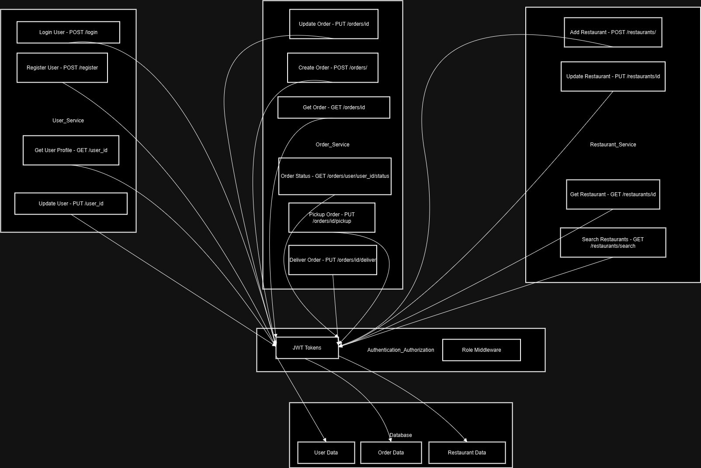
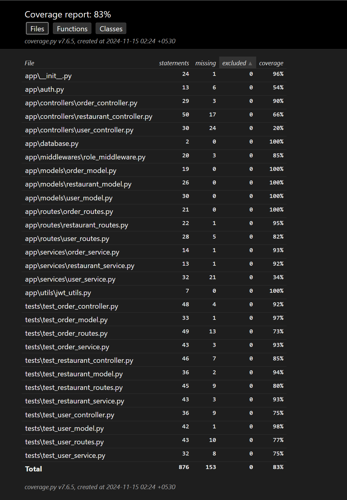

# Food Delivery App

This is a microservice-based food delivery app built with Flask.

---
# Contributers
This project was made by:
  1. **Prajwal Modak (2023mt93295)**- Created the endpoints and worked on documentation and basic unit tests. Implemented Swagger. <br>**Git repo:** https://github.com/PrajwalMod/Food_Delivery_App<br>

  2. **Prithviraj Dey (2023mt93070)**- Worked on the Database and Deployment and Testing. Completed test coverage and generated reports.
  <>**Git Repo:** https://github.com/dey27/Food_Delivery_App
  
  The overall directions of the project was a collective effort. We worked together on the concept, architecure and implementation based on our discussions.

  ### Video link
  Couldn't upload this or even compress the video enough to upload in Taxila. So it added here as a last resort.
  <br>https://drive.google.com/file/d/1gbHq9SfvebVrn8AaTEYUwsEBhyKtSFT7/view?usp=drive_link<br>

## Setup 

1. Clone the repository.
2. Create a virtual environment and activate it.
3. For windows
    ```commandline
    python3 -m venv venv
    .\venv\Scripts\activate.bat
    ```
4. For Linux
  ```commandline
    python3 -m venv venv
    source venv/bin/activate
  ```
5. Install the dependencies:
    ```sh
    pip install -r requirements.txt
    ```
6. Create a `.env` file and add your environment variables.
7. Run the application:
    ```sh
    python -m app.app
    ```

<div style="page-break-after: always;"></div>

## Architecture

The application is structured as a microservices-based architecture with the following components:


<div style="page-break-after: always;"></div>
## Database Structure
    ### Users Table

    +---------------------+     
    |       users         |
    +---------------------+
    | id (String, PK)     |
    | username (String)   |
    | email (String)      |
    | password (String)   |
    | role (String)       |
    | phone (String)      |
    | delivery_address    |
    | payment_info        |
    +---------------------+

  ### Orders Tables
    +---------------------+
    |       orders        |
    +---------------------+
    | id (String, PK)     |
    | user_id (String)    |
    | restaurant_id       |
    | items (PickleType)  |
    | total_price (Float) |
    | status (String)     |
    +---------------------+
  ### Restaurant Tables
  
    +---------------------+
    |    restaurants      |
    +---------------------+
    | id (String, PK)     |
    | name (String)       |
    | address (String)    |
    | cuisine (String)    |
    | menu (PickleType)   |
    | work_hours (String) |
    +---------------------+

### As you can see the application is structured into three main microservices:
  1. **User Service:** Handles user-related operations such as registration, login, profile retrieval, and profile updates.
  2. **Order Service:** Manages order-related operations such as creating orders, updating order statuses, and retrieving order details.
  3. **Restaurant Service:** Handles restaurant-related operations such as adding restaurants, updating restaurant details, and searching for restaurants.

### API Architecture Style
  The API follows the RESTful (Representational State Transfer) architecture style. This includes:
  1. **Resource-Based URLs:** The API endpoints are structured around resources such as users, orders, and restaurants.
  2. **HTTP Methods:** The API uses standard HTTP methods to perform CRUD (Create, Read, Update, Delete) operations.
  3. **Statelessness:** Each API request contains all the information needed to process the request, typically through the use of tokens for authentication and authorization.
  4. **Use of JSON:** The API uses JSON as the format for request and response bodies.
  5. **Clear Separation of Concerns:** The application is structured with separate services for users, orders, and restaurants, each with its own set of endpoints and responsibilities.

## Roles and Permissions
  ### Roles
  1. **User:** Can register, login, view and update their profile, place orders, and view order statuses.
  2. **Restaurant Owner:** Can add, update, and view restaurant details, and update order statuses to "Accepted" or "Rejected".
  3. **Delivery Agent:** Can update order statuses to "Picked Up" and "Delivered".
  ### Permissions
  1. **User:** Access to user-related endpoints.
  2. **Restaurant Owner:** Access to restaurant-related endpoints and order status updates.
  3. **Delivery Agent:** Access to order status updates for delivery.
  ### Order Statuses
  The following order statuses are used to track the progress of an order:
  1. **Pending:** The default status when an order is created.
  2. **Accepted:** The order has been accepted by the restaurant.
  3. **Rejected:** The order has been rejected by the restaurant.
  4. **Picked Up:** The order has been picked up by the delivery agent.
  5. **Delivered:** The order has been delivered to the customer.

### Data Validation
  The application includes basic data validation for email and password fields:
  1. The ``validate_email`` function ensures that the email format is valid using a regular expression.
  2. The ``validate_password`` function ensures that the password is strong by checking its length and the presence of digits.

## Endpoints

### User Endpoints
- **POST /api/users/register**: Register a new user.
  - **Request Body:**
    ```json
    {
      "username": "testuser",
      "email": "testuser@example.com",
      "password": "password",
      "role": "user"
    }
    ```
  - **Response:**
    ```json
    {
      "message": "User registered successfully"
    }
    ```

- **POST /api/users/login**: User login.
  - **Request Body:**
    ```json
    {
      "username": "testuser",
      "password": "password"
    }
    ```
  - **Response:**
    ```json
    {
      "token": "jwt_token"
    }
    ```

- **GET /api/users/<user_id>**: Get user profile.
  - **Response:**
    ```json
    {
      "username": "testuser",
      "email": "testuser@example.com",
      "phone": "1234567890",
      "delivery_address": "123 Test St",
      "payment_info": "Payment Info"
    }
    ```

- **PUT /api/users/<user_id>**: Update user details.
  - **Request Body:**
    ```json
    {
      "email": "newemail@example.com",
      "phone": "1234567890",
      "delivery_address": "123 New St",
      "payment_info": "New Payment Info"
    }
    ```
  - **Response:**
    ```json
    {
      "message": "User details updated successfully"
    }
    ```

### Order Endpoints
- **POST /api/orders/**: Create a new order.
  - **Request Body:**
    ```json
    {
      "user_id": "testuser",
      "restaurant_id": "testrestaurant",
      "items": ["item1", "item2"],
      "total_price": 100.0
    }
    ```
  - **Response:**
    ```json
    {
      "message": "Order created successfully"
    }
    ```

- **GET /api/orders/<order_id>**: Get order details.
  - **Response:**
    ```json
    {
      "user_id": "testuser",
      "restaurant_id": "testrestaurant",
      "items": ["item1", "item2"],
      "total_price": 100.0,
      "status": "Pending"
    }
    ```

- **GET /api/orders/user/<user_id>/status**: Get the status of orders for a user.
  - **Response:**
    ```json
    [
      {
        "user_id": "testuser",
        "restaurant_id": "testrestaurant",
        "items": ["item1", "item2"],
        "total_price": 100.0,
        "status": "Pending"
      }
    ]
    ```

- **PUT /api/orders/<order_id>/status**: Update order status (for restaurant owners).
  - **Request Body:**
    ```json
    {
      "status": "Accepted"
    }
    ```
  - **Response:**
    ```json
    {
      "message": "Order status updated successfully"
    }
    ```

- **PUT /api/orders/<order_id>/pickup**: Update order status to picked up (for delivery agents).
  - **Request Body:**
    ```json
    {
      "status": "Picked Up"
    }
    ```
  - **Response:**
    ```json
    {
      "message": "Order picked up successfully"
    }
    ```

- **PUT /api/orders/<order_id>/deliver**: Update order status to delivered (for delivery agents).
  - **Request Body:**
    ```json
    {
      "status": "Delivered"
    }
    ```
  - **Response:**
    ```json
    {
      "message": "Order delivered successfully"
    }
    ```

### Restaurant Endpoints
- **POST /api/restaurants/**: Add a new restaurant (for restaurant owners).
  - **Request Body:**
    ```json
    {
      "name": "Test Restaurant",
      "address": "123 Test St",
      "cuisine": "Test Cuisine",
      "menu": [
        {
          "name": "item1",
          "price": 10.0
        },
        {
          "name": "item2",
          "price": 15.0
        }
      ],
      "work_hours": "9 AM - 9 PM"
    }
    ```
  - **Response:**
    ```json
    {
      "message": "Restaurant added successfully"
    }
    ```

- **GET /api/restaurants/<restaurant_id>**: Get restaurant details.
  - **Response:**
    ```json
    {
      "name": "Test Restaurant",
      "address": "123 Test St",
      "cuisine": "Test Cuisine",
      "menu": [
        {
          "name": "item1",
          "price": 10.0
        },
        {
          "name": "item2",
          "price": 15.0
        }
      ],
      "work_hours": "9 AM - 9 PM"
    }
    ```

- **PUT /api/restaurants/<restaurant_id>**: Update restaurant details (for restaurant owners).
  - **Request Body:**
    ```json
    {
      "address": "123 New St",
      "cuisine": "New Cuisine",
      "menu": [
        {
          "name": "item1",
          "price": 12.0
        },
        {
          "name": "item2",
          "price": 18.0
        }
      ],
      "work_hours": "10 AM - 10 PM"
    }
    ```
  - **Response:**
    ```json
    {
      "message": "Restaurant details updated successfully"
    }
    ```

- **GET /api/restaurants/search**: Search for restaurants.
  - **Query Parameters:**
    - `cuisine` (optional): Filter by cuisine.
    - `max_price` (optional): Filter by maximum price.
  - **Response:**
    ```json
    [
      {
        "name": "Test Restaurant",
        "address": "123 Test St",
        "cuisine": "Test Cuisine",
        "menu": [
          {
            "name": "item1",
            "price": 10.0
          },
          {
            "name": "item2",
            "price": 15.0
          }
        ],
        "work_hours": "9 AM - 9 PM"
      }
    ]
    ```

# Running Tests

To ensure everything is working correctly, run your automated tests using `unittest`:

#### Using `unittest`
```sh
python -m unittest <test>
```

## Test Coverage

The following is a screenshot of the coverage report:



# Deployed API - Food Delivery App

This is the backend API for the Food Delivery App, deployed on Render with Supabase as the PostgreSQL database. This API allows you to manage users, restaurants, and orders for a food delivery service.

## Deployment Setup

### Render Deployment

To deploy the app on [Render](https://render.com/), follow these steps:

1. **Create a Render Account**: Sign up or log in to [Render](https://render.com/).
2. **Create a New Web Service**: 
   - Go to **Dashboard** and click on **New > Web Service**.
   - Connect your GitHub repository containing the Food Delivery App.
3. **Add a `render.yaml` File**: 
   - In the root directory of your repository, add a `render.yaml` file to specify the deployment settings.
   - Here’s a sample `render.yaml` file:

     ```yaml
     services:
       - type: web
         name: food-delivery-app
         env: python
         region: oregon
         buildCommand: "pip install -r requirements.txt"
         startCommand: "flask run --host=0.0.0.0 --port=10000"
         envVars:
           - key: DATABASE_URL
             value: "YOUR_SUPABASE_POSTGRES_URL"
     ```

   - Replace `"YOUR_SUPABASE_POSTGRES_URL"` with the actual Supabase PostgreSQL connection URL.
4. **Deploy the Service**: Render will automatically build and deploy the app based on the settings in `render.yaml`.

### Supabase Setup for PostgreSQL

To use Supabase as the PostgreSQL database backend:

1. **Create a Supabase Account**: Sign up or log in to [Supabase](https://supabase.io/).
2. **Create a New Project**:
   - Once logged in, click on **New Project**.
   - Choose a name, region, and database password, then click **Create new project**.
3. **Get the Database URL**:
   - Go to **Settings > Database** in your project and copy the `DATABASE_URL`.
   - Paste this URL into your `render.yaml` file under `DATABASE_URL` as shown above.
4. **Set Up Tables**:
   - Use the SQL Editor in Supabase to create tables (like `users`, `orders`, and `restaurants`) based on your app's data model.

---

## Base URL

After deploying, all API requests are made to the following base URL:

https://food-delivery-app-oyfl.onrender.com/

## Swagger URL 

All the endpoints can be found here: https://food-delivery-app-oyfl.onrender.com/apidocs/

## DISCLAIMER: Caveats with Render:
Please be aware that we are using a free version of render and there are certain limitations with that. Chief among them being the fact that after a period of inactivity, the page goes to hibernate and will take time to wake up. After that it will work normally.

## Testing with Postman

To test these APIs using Postman:

1. **Set Up Authorization**: Use the `/api/users/login` endpoint to get a token. Copy the token and set it as a Bearer token in Postman:
- Go to the **Authorization** tab.
- Choose **Bearer Token** as the type.
- Paste your token in the field provided.

2. **Create and Test Requests**:
- Create new requests for each endpoint.
- Set the request method (e.g., GET, POST) as required.
- For POST requests, go to the **Body** tab, select **raw** and choose **JSON** as the format, and then add the payload.
- Send the request and observe the response.

3. **Use the Base URL**:
- All requests should start with the base URL `https://food-delivery-app-oyfl.onrender.com/`.

4. **Check Authorization Requirements**:
- Ensure you add the token in the **Authorization** header for endpoints that require it.

## Database

The app uses [Supabase](https://supabase.io/) as a PostgreSQL database backend.

---

## License

This project is licensed under the MIT License.


